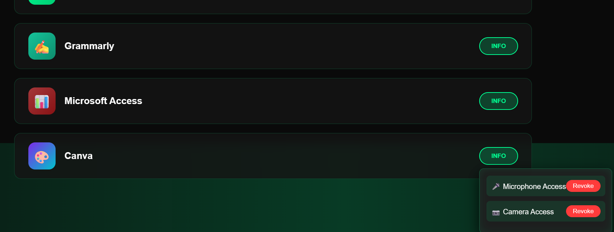

# CONTPRIVACY
 
Modern websites and apps frequently request access to sensitive resources such as the camera and microphone. While these permissions are often necessary for video calls, recordings, or interactive features, the real issue begins after the session ends. Many platforms continue to retain access even when the user has closed the site or app. Worse, once permission is granted, some cameras and microphones can operate silently in the background without showing any indicator, creating a hidden privacy risk.  

Users typically visit hundreds of websites over months and years, making it impossible to remember which platforms still hold these rights. Current solutions—browser dashboards or operating system settings—only display recent or active permissions. They fail to provide a complete historical record, leaving users exposed to forgotten, lingering access. This gap allows websites or apps to potentially misuse permissions, including selling or sharing sensitive data with third parties without explicit consent. The absence of a centralised, transparent audit trail means users cannot easily track or revoke permissions across time. This fragmented control undermines digital trust and creates vulnerabilities in everyday online interactions.  

## ✨ How Our App Helps
Our platform provides a **centralised privacy dashboard** where users can:  
- Audit all past and present camera/microphone permissions across sites and apps.  
- Revoke forgotten or lingering permissions with one click.  
- Visualise permission history through interactive charts and timelines.  
- Receive alerts when a site tries to access sensitive resources unexpectedly.  

This empowers users with **true control** over their personal data, restoring trust and preventing unauthorised surveillance.  

## 🛠️ Current Implementation
- **Frontend:** React.js  
- **Backend:** Node.js 
- **Database:** MongoDB 

## 🚀 Our Mission
We aim to close the privacy gap by giving users a **complete historical view** of permissions, not just recent activity. By combining transparency, control, and visualisation, CONTPRIVACY ensures safer digital experiences in an increasingly connected world.  

## 📸 Example Dashboard

Here’s how the permissions dashboard looks:

​
